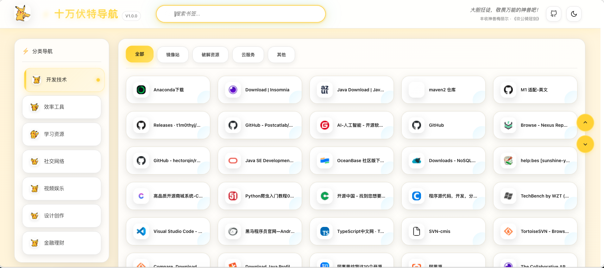

# 十万伏特导航

动漫风格的书签导航浏览器扩展插件（Chrome / Edge）

## 🎨 特性

### 核心功能
- ✅ **书签管理** - 读取浏览器书签并自动分类
- ✅ **多级分类** - 支持无限层级的书签文件夹
- ✅ **标签页切换** - 快速切换不同分类
- ✅ **智能搜索** - 实时搜索书签标题和网址
- ✅ **智能图标** - 自动检测并替换空白/纯色图标

### 效果图


### 视觉特色
- 🎨 动漫风格 UI 设计（皮卡丘主题）
- 🌈 渐变色系统（红/黄/青三色）
- ✨ 流畅的 CSS 动画和过渡效果
- 🎯 悬停交互反馈
- 📱 响应式布局
- 🌓 深色/浅色主题切换

## 🛠️ 技术栈

### 前端框架
- **Vue 3** - 渐进式 JavaScript 框架
- **TypeScript** - 类型安全
- **Pinia** - 状态管理
- **Vue Router** - 路由管理
- **Vite** - 下一代前端构建工具

### 代码质量工具
- **Oxlint** - 极速 Rust linter
- **ESLint** - 代码检查
- **Prettier** - 代码格式化
- **Vitest** - 单元测试框架

### 浏览器 API
- Chrome Extensions Manifest V3
- `chrome.bookmarks` API
- `chrome.tabs` API
- `chrome.runtime` API
- `chrome.action` API

## 📁 项目结构

```
bookmark-app/
├── dist/                    # 构建输出目录
│   ├── index.html          # 新标签页
│   ├── popup.html          # 弹窗页面
│   ├── background.html     # 后台页面
│   ├── *.js                # 构建的 JS 文件
│   ├── *.css               # 构建的 CSS 文件
│   └── png/                # 图片资源
├── public/                  # 公共资源
│   └── favicon.ico         # 网站图标
├── src/                     # 源代码
│   ├── views/              # 页面组件
│   │   ├── HomeView.vue   # 新标签页视图
│   │   ├── PopupView.vue  # 弹窗视图
│   │   └── AboutView.vue  # 关于页面
│   ├── stores/             # Pinia 状态管理
│   │   ├── bookmark.ts    # 书签状态
│   │   ├── search.ts      # 搜索状态
│   │   └── counter.ts     # 计数器状态
│   ├── router/             # 路由配置
│   │   └── index.ts       # 路由定义
│   ├── components/         # 组件
│   │   ├── icons/         # 图标组件
│   │   ├── HelloWorld.vue
│   │   ├── TheWelcome.vue
│   │   └── WelcomeItem.vue
│   ├── assets/             # 静态资源
│   │   ├── base.css
│   │   ├── main.css
│   │   └── logo.svg
│   ├── App.vue             # 根组件
│   ├── main.ts             # 新标签页入口
│   ├── popup.ts            # 弹窗入口
│   ├── background.ts       # 后台服务
│   ├── global.d.ts         # 全局类型定义
│   └── manifest.json       # 扩展配置
├── index.html              # 新标签页入口 HTML
├── popup.html              # 弹窗入口 HTML
├── background.html         # 后台入口 HTML
├── package.json
├── vite.config.ts
└── tsconfig.json
```

## 🚀 开发

### 安装依赖
```bash
cd bookmark-app
npm install
```

### 开发模式
```bash
cd bookmark-app
npm run dev
```

### 构建生产版本
```bash
cd bookmark-app
npm run build
```

### 代码检查
```bash
cd bookmark-app
npm run lint
```

### 代码格式化
```bash
cd bookmark-app
npx prettier --write "src/**/*.{vue,ts,tsx}"
```

### 类型检查
```bash
cd bookmark-app
npm run type-check
```

### 单元测试
```bash
cd bookmark-app
npm run test:unit
```

## 📦 扩展安装

1. 构建项目：`cd bookmark-app && npm run build`
2. 打开 Chrome/Edge 浏览器
3. 进入 `chrome://extensions/` 或 `edge://extensions/`
4. 启用"开发者模式"
5. 点击"加载已解压的扩展程序"
6. 选择 `bookmark-app/dist` 目录

## 🎯 功能清单

### 核心功能
- ✅ 读取浏览器书签
- ✅ 自动分类整理
- ✅ 多级文件夹支持
- ✅ 标签页切换
- ✅ 搜索书签
- ✅ 智能图标处理
- ✅ 错误处理
- ✅ 空状态提示
- ✅ 点击数据统计
- ✅ 每日一言显示
- ✅ 深色/浅色主题切换
- ✅ 性能监控

### 增强功能
- ✅ 实时搜索
- ✅ 状态持久化
- ✅ 类型安全
- ✅ 响应式更新
- ✅ 组件化架构
- ✅ 点击次数记录
- ✅ 最近点击排序
- ✅ 缓存优化

## 📊 性能优化

- **代码分割** - 自动分割 chunk
- **懒加载** - 路由级懒加载
- **压缩优化** - Gzip 压缩
- **资源优化** - 图标懒加载

## 🎨 样式系统

### CSS 变量
```css
--primary-color: #ff6b6b
--secondary-color: #ffcb05
--accent-color: #4ecdc4
```

### 动画效果
- 背景渐变动画
- 侧边栏悬停动画
- 书签卡片悬停效果
- 标签页切换动画

## 📝 开发说明

### 添加新页面
1. 在 `src/views/` 创建新组件
2. 在 `src/router/index.ts` 添加路由
3. 在 `vite.config.ts` 添加入口

### 添加新状态
1. 在 `src/stores/` 创建新 store
2. 使用 `defineStore` 定义状态
3. 在组件中使用 `useStore`

## 🤝 贡献

欢迎提交 Issue 和 Pull Request！

## 📄 许可证

MIT License

## 🙏 致谢

- Vue.js 团队
- Chrome Extensions 团队
- 所有用户的支持

---

**版本**: 1.0.0  
**作者**: carson1993  
**最后更新**: 2026-03-31


[def]: Display.png