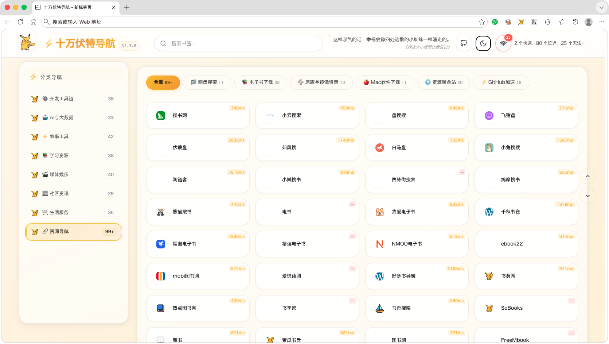

# 十万伏特导航

动漫风格的书签导航浏览器扩展插件（Chrome / Edge）

## 特性

### 核心功能
- **书签管理** - 读取浏览器书签并自动按文件夹分类
- **两级分类** - 支持分类和子分类的书签组织结构
- **标签页切换** - 同一分类下快速切换子分类
- **拼音搜索** - 支持中文、英文、拼音全拼和首字母的模糊搜索
- **拖拽移动** - 拖拽书签卡片到侧边栏分类即可移动书签
- **链接测速** - 一键检测当前分类下所有书签的连通性和延迟
- **智能图标** - Canvas 透明度检测 + 四级降级（本地缓存 → Chrome 缓存 → 网站直取 → Google CDN → 皮卡丘占位图）
- **图标缓存** - 成功加载的 favicon 自动缓存到 localStorage，减少网络消耗

### 效果图


### 视觉特色
- 动漫风格 UI 设计（皮卡丘主题）
- 玻璃拟态（Glassmorphism）+ 电光金配色
- 流畅的 CSS 动画和过渡效果
- 悬停交互反馈和发光效果
- 响应式布局（≥1440px / ≤992px / ≤640px 三断点）
- 深色/浅色主题切换

## 技术栈

### 前端框架
- **Vue 3** - Composition API + `<script setup>`
- **TypeScript** - 类型安全
- **Pinia** - 状态管理
- **Vue Router** - 路由管理（Hash 模式）
- **Vite** - 多入口构建工具

### 核心依赖
- **pinyin-pro** - 中文拼音转换，支持全拼和首字母搜索

### 代码质量工具
- **ESLint** - 代码检查
- **Prettier** - 代码格式化
- **vue-tsc** - TypeScript 类型检查

### 浏览器 API
- Chrome Extensions Manifest V3
- `chrome.bookmarks` API（读取、移动书签）
- `chrome.tabs` API（标签页管理）
- `chrome._favicon` API（图标获取）
- `chrome.action` API（扩展图标点击）

## 项目结构

```
bookmark-app/
├── dist/                    # 构建输出目录
│   ├── index.html          # 新标签页
│   ├── popup.html          # 弹窗页面
│   ├── background.html     # 后台页面
│   ├── *.js                # 构建的 JS 文件
│   ├── *.css               # 构建的 CSS 文件
│   └── png/                # 图片资源
├── src/                     # 源代码
│   ├── views/              # 页面组件
│   │   ├── HomeView.vue   # 新标签页视图（核心页面）
│   │   └── PopupView.vue  # 弹窗视图
│   ├── stores/             # Pinia 状态管理
│   │   ├── bookmark.ts    # 书签数据 + 拼音索引
│   │   └── search.ts      # 搜索过滤（含拼音匹配）
│   ├── router/             # 路由配置
│   │   └── index.ts       # 路由定义
│   ├── assets/             # 静态资源
│   │   ├── base.css        # 基础样式
│   │   └── main.css        # 主样式
│   ├── App.vue             # 根组件
│   ├── main.ts             # 新标签页入口
│   ├── popup.ts            # 弹窗入口
│   ├── background.ts       # 后台 Service Worker
│   ├── global.d.ts         # 全局类型定义
│   └── manifest.json       # 扩展配置（源文件）
├── index.html              # 新标签页入口 HTML
├── popup.html              # 弹窗入口 HTML
├── background.html         # 后台入口 HTML
├── package.json
├── vite.config.ts          # 多入口构建配置
└── tsconfig.json
```

## 开发

### 安装依赖
```bash
cd bookmark-app
npm install
```

### 开发模式
```bash
cd bookmark-app
npm run dev
```

### 构建生产版本
```bash
cd bookmark-app
npm run build
```

### 代码格式化
```bash
cd bookmark-app
npx prettier --write "src/**/*.{vue,ts,tsx}"
```

### 类型检查
```bash
cd bookmark-app
npx vue-tsc --noEmit
```

## 扩展安装

1. 构建项目：`cd bookmark-app && npm run build`
2. 打开 Chrome/Edge 浏览器
3. 进入 `chrome://extensions/` 或 `edge://extensions/`
4. 启用"开发者模式"
5. 点击"加载已解压的扩展程序"
6. 选择 `bookmark-app/dist` 目录

## 功能清单

### 已实现
- 读取浏览器书签并自动分类
- 两级分类 + 子分类标签页切换
- 拼音搜索（中文、英文、全拼、首字母）
- Canvas 透明度检测 + 四级 favicon 降级加载
- favicon localStorage 缓存（LRU 淘汰，最多 120 条）
- 书签拖拽移动到其他分类
- 链接连通性测速（延迟徽章展示）
- 每日一言（hitokoto API，10 分钟缓存）
- 深色/浅色主题切换（CSS Design Tokens）
- 性能监控（FP/FCP + 内存 + 加载时间）
- 响应式布局（三断点适配）
- 错误处理和空状态提示

## 架构设计

### 四级 Favicon 降级链
```
localStorage 缓存 → Chrome _favicon/ API → 网站直取 /favicon.ico → Google S2 CDN → 皮卡丘占位图
```

### 拼音搜索原理
```
"阿里云" → pinyin-pro 解析 → ["a", "li", "yun"]
  ├── 全拼索引: "aliyun"
  └── 首字母索引: "aly"
  
搜索 "a" / "ali" / "yun" / "aly" / "liyun" 均可匹配
```

## 贡献

欢迎提交 Issue 和 Pull Request！

## 许可证

MIT License

## 致谢

- Vue.js 团队
- Chrome Extensions 团队
- pinyin-pro 作者
- hitokoto 一言 API

---

**版本**: 1.1.0  
**作者**: carson1993  
**最后更新**: 2026-06-15